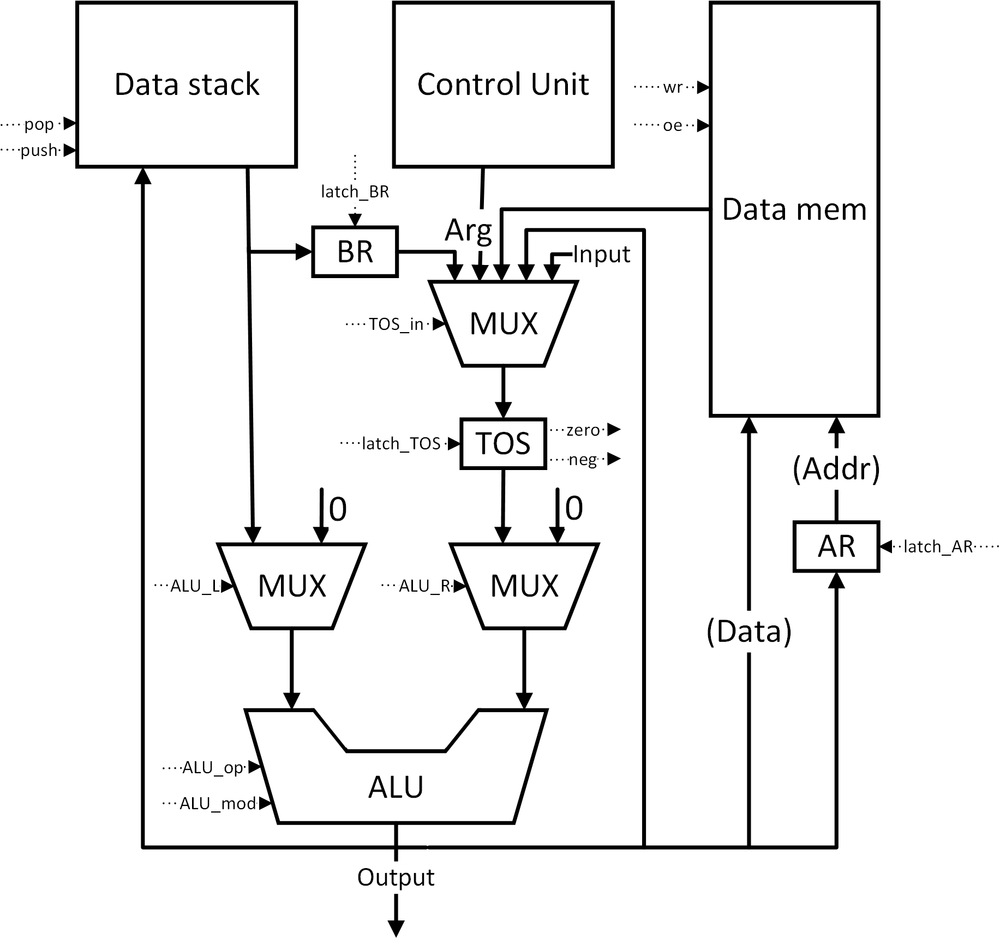
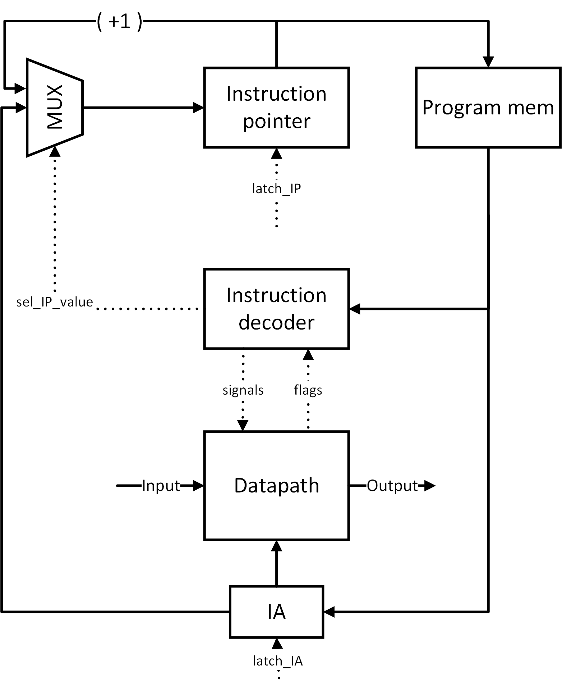

# АК 2024. Лабораторная работа №3
+ Марухленко Иван Сергеевич
+ Группа P3233
+ Вариант `lisp -> asm | stack | harv | hw | instr | binary -> struct | stream | port | pstr | prob2 | cache`
+ Выполнен: упрощенный `asm | stack | harv | hw | instr | struct | stream | port | pstr | prob2 | -`

## Язык программирования
### Синтаксис
``` ebnf
program ::= "section .data\n" { data_line } "section .code\n" { code_line } | { code_line }

data_line ::= label "\n" 
            | "word" integer "\n" 
            | "word" pos_integer, string "\n" 
            | "buf" pos_integer "\n"

code_line ::= label "\n" 
            | instr "\n"

label ::= label_name ":"

instr ::= op0 
        | op1 label_name 
        | op2 integer

op0 ::= "dup"
    | "add"
    | "dec"
    | "swap"
    | "mod2"
    | "del_tos"
    | "push_by"
    | "pop_by"
    | "print"
    | "input"
    | "halt"

op1 ::= "jz"
    | "jg"
    | "jmp"
    | "pop"
    | "push"

op2 ::= "push"

pos_integer ::= "0" | [ <any of "1-9"> ] { <any of "0-9"> }

integer ::= [ "-" ] pos_integer

string ::= '"' { <any symbol except '"'> } '"' | "'" { <any symbol except "'"> } "'"

label_name ::= <any of "a-z A-Z _"> { <any of "a-z A-Z 0-9 _"> }
```

### Особенности языка
+ строгое разделение на секции данных и инструкций в коде
+ код выполняется последовательно, начиная с первой строки, если секции не указаны, иначе начиная с первой строки после `section .code`
+ метки возможны и в секции данных, и в секции инструкций, однако использовать одну в качестве другой - запрещено
+ область видимости всех меток - глобальная
+ возможна работа с целочисленными значениями и p-строками
+ память выделяется статически при запуске модели
+ корректное завершение программы возможно только исполнением инструкции (`halt`)

## Организация памяти
Гарвардская организация памяти: памяти инструкций и данных разделены.
В Datapath для хранения промежуточных результатов и аргументов команд используется стек (реализация - [Stack](memory.py))
### Память команд
+ Машинное слово - не определено
+ Реализуется списком словарей, описывающих инструкции

### Память данных
+ Машинное слово - 32 бита
+ Адресное пространство линейное, адресуется числами от 0 до n

Строковые литералы во время компиляции преобразуются в целочисленные. Размер строки предшествует строке.

## Система команд

+ Процессор оперирует целыми 
+ Доступ к памяти осуществляется с помощью специальных регитстров (`IP` для Program Mem и `AR` для Data Mem)
+ Вершина стека отделена от самого стека для возможности подачи в АЛУ сразу двух значений со стека. Целостность поддерживается на уровне аппаратуры
+ Возможные операции в АЛУ: +/-, mod2 результата
+ Поток управления:
    + Инкремент `IP` после выполнения каждой инструкции, или
    + Безусловный (`jmp`) и условные переходы (`jz` и `jg`)


### Набор инструкций
| Язык                           | Инструкция         | Кол-во тактов | Описание                                                                                            |
|--------------------------------|--------------------|---------------|-----------------------------------------------------------------------------------------------------|
| `dup`                          | DUP                |       1       | Дублирует значение на вершине стека                                                                 |
| `add`                          | ADD                |       2       | Берет два значения с вершины стека и кладет на стек их сумму                                        |
| `dec`                          | DEC                |       2       | Берет два значения с вершины стека и кладет на стек их разность                                     |
| `swap`                         | SWAP               |       4       | Меняет местами два значения на вершине стека                                                        |
| `mod2`                         | MOD2               |       1       | Берет значение с вершины стека и кладет на стек остаток от деления этого значения на 2              |
| `print`                        | PRINT              |       3       | Берет значение с вершины стека и отправляет его на порт вывода                                      |
| `input`                        | INPUT              |       1       | Читает значение из порта ввода и кладет его на стек                                                 |
| `jmp <label>`                  | JMP `<addr>`       |       1       | Совершает переход на инструкцию по адресу `<addr>`                                                  |
| `jz <label>`                   | JZ `<addr>`        |       1       | Совершает переход на инструкцию по адресу `<addr>`, если на вершине стека 0                         |
| `jg <label>`                   | JG `<addr>`        |       1       | Совершает переход на инструкцию по адресу `<addr>`, если на вершине отрицательное число             |
| `push_by`                      | PUSH_BY            |       2       | Берет адрес с вершины стека и кладет на стек значение из памяти по этому адресу                     |
| `push <int>` or `push <label>` | PUSH `<int\|addr>` |       2       | Кладет на стек число/адрес `<int\|addr>`                                                            |
| `pop_by`                       | POP_BY             |       5       | Берет адрес и значение с вершины стека, записывает в память считанное значение по считанному адресу |
| `pop <label>`                  | POP `<addr>`       |       7       | Берет значение с вершины стека и записывает его в память по адресу `<addr>`                         |
| `del_tos`                      | DEL_TOS            |       2       | Удаляет значение с вершины стека                                                                    |
| `halt`                         | HALT               |       0       | Останов                                                                                             |

Чтение инструкции происходит за 1 такт

### Кодирование инструкций
+ Машинный код сериализуется в список JSON.
+ Один элемент списка - одна инструкция.
+ В качестве первого элемента списка может выступать массив инициализации памяти данных.
+ Индекс списка - номер инструкции. Используется для команд перехода.
Пример:
``` json
[
    {
        "opcode": "push",
        "arg": 1,
        "term": [
            1,
            0,
            "push 1"
        ]
    }
]
```
где:

+ `opcode` - строка с кодом операции;
+ `arg` - аргумент (может отсутствовать);
+ `term` - информация о связанном месте в исходном коде (если есть)


## Транслятор
Интерфейс командной строки: `translator.py <input_file> [<target_file>]`

Если `<target_file>` не указан, имя целевого файла берется за `<input_file>.code`

Реализован в модуле: [translator](translator.py)

Этапы трансляции (функция translate):
+ Определение наличия секций, выбор транслятора
+ Трансляция программы в машинный код, проверка корректности синтаксиса
+ Подстановка адресов меток в сгенерированный код

Правила генерации машинного кода:
+ все команды языка напрямую транслируются в соответствующие инструкции (см. Набор инструкций)
+ метки не транслируются, в аргументах команд заменяются на соответствующие адреса
+ заголовки секций не транслируются, но позволяют разделить объявление данных и инструкций в коде
+ конструкции 'word' и 'buf' не транслируются, но определяют состояние памяти данных на момент запуска программы

для команд, однозначно соответствующих инструкциям, -- прямое отображение;

для циклов с соблюдением парности (многоточие -- произвольный код):

## Модель процессора

Интерфейс командной строки: `machine.py <program_file> [<input_file>]`.

Метод запуска симуляции `simulation` реализован в файле [machine.py](machine.py)

### DataPath

Реализован в классе [Datapath](datapath.py)
+ `Data stack` - аппаратный стек, либо кладем новое значение на вершину, либо удаляем
+ `TOS` - регистр вершины стека, отделен для возможности подачи на АЛУ сразу 2-х значений со стека
+ `Data mem` - память данных, однопортовая
+ `AR` - адресный регистр
+ `BR` - буферный регистр, используется для реализации инструкций процесоора (например, SWAP)
+ `ALU` - арифметико-логическое устройство, способно выполнять операции +/-, а также форматировать результат под остаток деления на 2 (mod 2)

Сигналы:
+ `latch_<Register>` - защелкнуть в регистре значение, поданное на его вход (может определяться другими сигналами)
+ `TOS_in` - выбрать значение на входе TOS (BR/Arg от CU/Memory/ALU/Input)
+ `ALU_L` - выбрать аргумент, подаваемый на левый вход АЛУ (0 или значение со стека)
+ `ALU_R` - выбрать аргумент, подаваемый на правый вход АЛУ (0 или значение из TOS)
+ `ALU_op` - выбрать операцию в АЛУ (+/-)
+ `ALU_mod` - выводить из АЛУ результат операции/результат mod 2
+ `push` - защелкнуть в стеке значение на его входе
+ `pop` - удалить значение с вершины стека
+ `wr` - записать значение (Data) по адресу (Addr) в память
+ `oe` - прочитать значение по адресу (Addr) из памяти

Флаги:
+ `zero` - TOS == 0
+ `neg` - TOS < 0


### ControlUnit

Реализован в классе [ControlUnit](controlunit.py)
+ Hardwired
+ метод `decode_and_execution` моделирует выполнение полного цикла инструкции
+ `Instruction pointer` - регистр с адресом текущей инструкции
+ `Program mem` - память команд
+ `Instruction decoder` - схема для преобразования инструкций процессора в низкоуровневые сигналы
+ `IA` - регистр, хранящий аргумент текущей инструкции. Может быть использован Datapath (например, при исполнении команды push <integer>), или в ControlUnit для хранения адреса прыжка
+ В реализации присутствует счетчик тактов (метод `tick()` - конец такта), необходимый для выполнения многотактовых инструкций

Сигналы:
+ `latch_<register>` - защелкнуть значение на входе регистра
+ `sel_IP_value` - выбор значения на входе IP


Особенности работы модели:
+ Цикл симуляции осуществляется в функции `simulation`
+ Шаг моделирования соответствует одной инструкции с выводом состояния в журнал
+ Для журнала состояний процессора используется стандартный модуль logging.
+ Остановка моделирования осуществляется при:
    + исключении StopIteration - если выполнена инструкция halt
    + любого другого исключения (в случае возникновения ошибки внутри модели)

## Тестирование
Были разработаны следующие тесты:
+ [hello.yml](./golden/hello.yml) - печатает "Hello, World!"
+ [hello_user_name.yml](./golden/hello_user_name.yml) - запрашивает у пользователя его имя, считывает его, выводит на экран приветствие
+ [cat.yml](./golden/cat.yml) - печатает данные, поданные на вход симулятору через файл ввода
+ [prob2.yml](./golden/prob2.yml) - вычисляет сумму четных чисел Фибоначчи, не превышающих 4000000
+ [overflow.yml](./golden/overflow.yml) - выводит сумму 2^31 - 1 и 1, тест на переполнение типа

Рассмотрим алгоритм [cat.asm](./programs/cat.asm):
```
loop:
    input
    jz end
    print
    jmp loop
end:
    halt
```

Трансляция алгоритма (имя целевого файла не указано, берется стандартное):
```
C:\Users\Ivan\csa-stack-machine> python .\translator.py .\programs\cat.asm
input file: .\programs\cat.asm
output file: .\programs\cat.asm.out
LoC: 7 code_instr: 5

translation is succesful
```

Полученный машинный код:
```
[{"opcode": "input", "term": [2, 4, "input"]},
 {"opcode": "jz", "arg": 4, "term": [3, 4, "jz end"]},
 {"opcode": "print", "term": [4, 4, "print"]},
 {"opcode": "jmp", "arg": 0, "term": [5, 4, "jmp loop"]},
 {"opcode": "halt", "term": [7, 4, "halt"]}]
```

Запуск кода на модели:
```
C:\Users\Ivan\csa-stack-machine> python .\machine.py .\programs\cat.asm.out .\programs\input.txt
DEBUG:root:TICK:   0 IP:   0 AR:   0 MEM_OUT:   0 INSTR: input      TOS:   0 STACK: []
DEBUG:root:input: 73
DEBUG:root:TICK:   2 IP:   1 AR:   0 MEM_OUT:   0 INSTR: jz 4       TOS:  73 STACK: [0]
DEBUG:root:TICK:   4 IP:   2 AR:   0 MEM_OUT:   0 INSTR: print      TOS:  73 STACK: [0]
DEBUG:root:output: [] << 73
DEBUG:root:TICK:   8 IP:   3 AR:   0 MEM_OUT:   0 INSTR: jmp 0      TOS:   0 STACK: []
DEBUG:root:TICK:  10 IP:   0 AR:   0 MEM_OUT:   0 INSTR: input      TOS:   0 STACK: []
DEBUG:root:input: 118
DEBUG:root:TICK:  12 IP:   1 AR:   0 MEM_OUT:   0 INSTR: jz 4       TOS: 118 STACK: [0]
DEBUG:root:TICK:  14 IP:   2 AR:   0 MEM_OUT:   0 INSTR: print      TOS: 118 STACK: [0]
DEBUG:root:output: [73] << 118
DEBUG:root:TICK:  18 IP:   3 AR:   0 MEM_OUT:   0 INSTR: jmp 0      TOS:   0 STACK: []
DEBUG:root:TICK:  20 IP:   0 AR:   0 MEM_OUT:   0 INSTR: input      TOS:   0 STACK: []
DEBUG:root:input: 97
DEBUG:root:TICK:  22 IP:   1 AR:   0 MEM_OUT:   0 INSTR: jz 4       TOS:  97 STACK: [0]
DEBUG:root:TICK:  24 IP:   2 AR:   0 MEM_OUT:   0 INSTR: print      TOS:  97 STACK: [0]
DEBUG:root:output: [73, 118] << 97
DEBUG:root:TICK:  28 IP:   3 AR:   0 MEM_OUT:   0 INSTR: jmp 0      TOS:   0 STACK: []
DEBUG:root:TICK:  30 IP:   0 AR:   0 MEM_OUT:   0 INSTR: input      TOS:   0 STACK: []
DEBUG:root:input: 110
DEBUG:root:TICK:  32 IP:   1 AR:   0 MEM_OUT:   0 INSTR: jz 4       TOS: 110 STACK: [0]
DEBUG:root:TICK:  34 IP:   2 AR:   0 MEM_OUT:   0 INSTR: print      TOS: 110 STACK: [0]
DEBUG:root:output: [73, 118, 97] << 110
DEBUG:root:TICK:  38 IP:   3 AR:   0 MEM_OUT:   0 INSTR: jmp 0      TOS:   0 STACK: []
DEBUG:root:TICK:  40 IP:   0 AR:   0 MEM_OUT:   0 INSTR: input      TOS:   0 STACK: []
DEBUG:root:input: 32
DEBUG:root:TICK:  42 IP:   1 AR:   0 MEM_OUT:   0 INSTR: jz 4       TOS:  32 STACK: [0]
DEBUG:root:TICK:  44 IP:   2 AR:   0 MEM_OUT:   0 INSTR: print      TOS:  32 STACK: [0]
DEBUG:root:output: [73, 118, 97, 110] << 32
DEBUG:root:TICK:  48 IP:   3 AR:   0 MEM_OUT:   0 INSTR: jmp 0      TOS:   0 STACK: []
DEBUG:root:TICK:  50 IP:   0 AR:   0 MEM_OUT:   0 INSTR: input      TOS:   0 STACK: []
DEBUG:root:input: 77
DEBUG:root:TICK:  52 IP:   1 AR:   0 MEM_OUT:   0 INSTR: jz 4       TOS:  77 STACK: [0]
DEBUG:root:TICK:  54 IP:   2 AR:   0 MEM_OUT:   0 INSTR: print      TOS:  77 STACK: [0]
DEBUG:root:output: [73, 118, 97, 110, 32] << 77
DEBUG:root:TICK:  58 IP:   3 AR:   0 MEM_OUT:   0 INSTR: jmp 0      TOS:   0 STACK: []
DEBUG:root:TICK:  60 IP:   0 AR:   0 MEM_OUT:   0 INSTR: input      TOS:   0 STACK: []
DEBUG:root:input: 46
DEBUG:root:TICK:  62 IP:   1 AR:   0 MEM_OUT:   0 INSTR: jz 4       TOS:  46 STACK: [0]
DEBUG:root:TICK:  64 IP:   2 AR:   0 MEM_OUT:   0 INSTR: print      TOS:  46 STACK: [0]
DEBUG:root:output: [73, 118, 97, 110, 32, 77] << 46
DEBUG:root:TICK:  68 IP:   3 AR:   0 MEM_OUT:   0 INSTR: jmp 0      TOS:   0 STACK: []
DEBUG:root:TICK:  70 IP:   0 AR:   0 MEM_OUT:   0 INSTR: input      TOS:   0 STACK: []
WARNING:root:input: EMPTY!
DEBUG:root:TICK:  72 IP:   1 AR:   0 MEM_OUT:   0 INSTR: jz 4       TOS:   0 STACK: [0]
DEBUG:root:TICK:  74 IP:   4 AR:   0 MEM_OUT:   0 INSTR: halt       TOS:   0 STACK: [0]
INFO:root:Simulation ended!
INFO:root:output_buffer (string): Ivan M.
INFO:root:output_buffer (values): [73, 118, 97, 110, 32, 77, 46]
output: Ivan M.
DEBUG:root:TICK:  60 IP:   0 AR:   0 MEM_OUT:   0 INSTR: input      TOS:   0 STACK: []
DEBUG:root:input: 46
DEBUG:root:TICK:  62 IP:   1 AR:   0 MEM_OUT:   0 INSTR: jz 4       TOS:  46 STACK: [0]
DEBUG:root:TICK:  64 IP:   2 AR:   0 MEM_OUT:   0 INSTR: print      TOS:  46 STACK: [0]
DEBUG:root:output: [73, 118, 97, 110, 32, 77] << 46
DEBUG:root:TICK:  68 IP:   3 AR:   0 MEM_OUT:   0 INSTR: jmp 0      TOS:   0 STACK: []
DEBUG:root:TICK:  70 IP:   0 AR:   0 MEM_OUT:   0 INSTR: input      TOS:   0 STACK: []
WARNING:root:input: EMPTY!
DEBUG:root:TICK:  72 IP:   1 AR:   0 MEM_OUT:   0 INSTR: jz 4       TOS:   0 STACK: [0]
DEBUG:root:TICK:  74 IP:   4 AR:   0 MEM_OUT:   0 INSTR: halt       TOS:   0 STACK: [0]
INFO:root:Simulation ended!
INFO:root:output_buffer (string): Ivan M.
INFO:root:output_buffer (values): [73, 118, 97, 110, 32, 77, 46]
output: Ivan M.
instr_counter: 31 ticks: 75
```

Запуск тестов:
```
C:\Users\Ivan\csa-stack-machine>poetry run pytest . -v
=========================== test session starts ============================
platform win32 -- Python 3.11.0, pytest-7.4.4, pluggy-1.5.0 -- C:\Users\Ivan\AppData\Local\Programs\Python\Python311\python.exe
cachedir: .pytest_cache
rootdir: C:\Users\Ivan\csa-stack-machine
configfile: pyproject.toml
plugins: golden-0.2.2
collected 5 items

golden_test.py::test_translator_and_machine[golden/cat.yml] PASSED    [ 20%]
golden_test.py::test_translator_and_machine[golden/hello.yml] PASSED  [ 40%]
golden_test.py::test_translator_and_machine[golden/hello_user_name.yml] PASSED [ 60%]
golden_test.py::test_translator_and_machine[golden/overflow.yml] PASSED [ 80%]
golden_test.py::test_translator_and_machine[golden/prob2.yml] PASSED  [100%]

============================ 5 passed in 0.47s =============================
```

Сводка по тестам:
```
| ФИО                       | алг             | LoC  | code инстр. | инстр.   | такт.  |
| Марухленко Иван Сергеевич | hello           | 24   | 15          | 148      | 466    |
| Марухленко Иван Сергеевич | hello_user_name | 110  | 81          | 495      | 1563   |
| Марухленко Иван Сергеевич | cat             | 7    | 5           | 31       | 75     |
| Марухленко Иван Сергеевич | prob2           | 45   | 30          | 648      | 2057   |
| Марухленко Иван Сергеевич | overflow        | 11   | 6           | 6        | 17     |
```